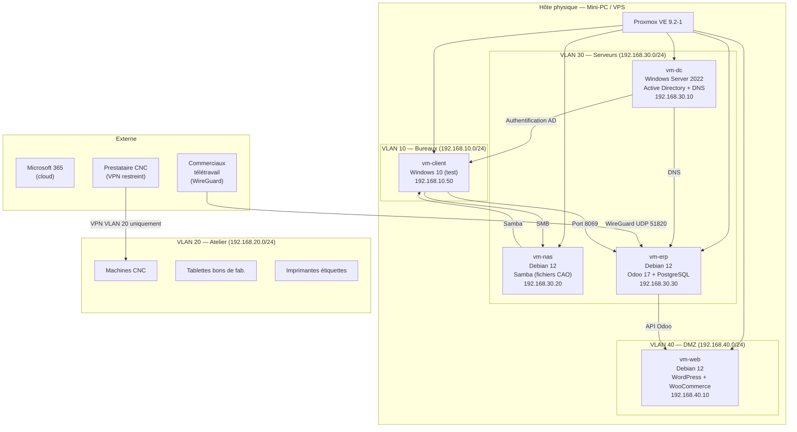

                                                                                                                                                                                                                                                                    # Schéma — Architecture logique METALIS

## Diagramme (Mermaid)



## Représentation textuelle

```
┌─────────────────────────────────────────────────────────────┐
│                    Hôte Proxmox VE                          │
│                                                             │
│  ┌──────────────┐  ┌──────────────┐  ┌──────────────┐      │
│  │   vm-dc      │  │   vm-nas     │  │   vm-erp     │      │
│  │ Win Srv 2022 │  │  Debian 12   │  │  Debian 12   │      │
│  │ AD + DNS     │  │ Samba / CAO  │  │ Odoo + PgSQL │      │
│  │ .30.10       │  │ .30.20       │  │ .30.30       │      │
│  └──────────────┘  └──────────────┘  └──────────────┘      │
│         VLAN 30 — Serveurs (192.168.30.0/24)                │
│  ┌──────────────┐  ┌──────────────┐                         │
│  │   vm-web     │  │  vm-client   │                         │
│  │  Debian 12   │  │  Windows 10  │                         │
│  │ WP+WooComm.  │  │  (test)      │                         │
│  │ .40.10       │  │ .10.50       │                         │
│  └──────────────┘  └──────────────┘                         │
│   VLAN 40 — DMZ        VLAN 10 — Bureaux                    │
└─────────────────────────────────────────────────────────────┘

VLAN 20 — Atelier (physique)
  ├── Machines CNC (192.168.20.x)
  ├── Tablettes bons de fabrication
  └── Imprimantes étiquettes, douchettes

Accès externes :
  ├── Commerciaux télétravail → VPN WireGuard → vm-erp
  ├── Prestataire CNC → VPN restreint → VLAN 20 uniquement
  └── Clients web → Internet → vm-web (DMZ)
```
