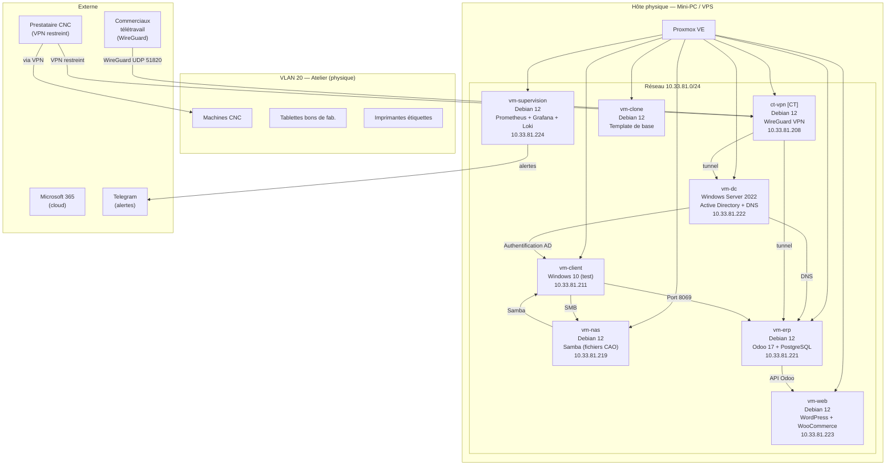

                                                                                                                                                                                                                                                                    # Schéma — Architecture logique METALIS

## Diagramme (Mermaid)



## Représentation textuelle

```
┌─────────────────────────────────────────────────────────────────────────┐
│                         Hôte Proxmox VE                                 │
│                      Réseau : 10.33.81.0/24                             │
│                                                                         │
│  ┌──────────────┐  ┌──────────────┐  ┌──────────────┐                  │
│  │  [CT] ct-vpn │  │   vm-dc      │  │   vm-nas     │                  │
│  │  Debian 12   │  │ Win Srv 2022 │  │  Debian 12   │                  │
│  │  WireGuard   │  │  AD + DNS    │  │ Samba / CAO  │                  │
│  │ .81.208      │  │ .81.222      │  │ .81.219      │                  │
│  └──────────────┘  └──────────────┘  └──────────────┘                  │
│                                                                         │
│  ┌──────────────┐  ┌──────────────┐  ┌──────────────┐                  │
│  │   vm-erp     │  │   vm-web     │  │ vm-supervision│                 │
│  │  Debian 12   │  │  Debian 12   │  │  Debian 12   │                  │
│  │ Odoo + PgSQL │  │ WP+WooComm.  │  │ Prom+Graf+Loki│                 │
│  │ .81.221      │  │ .81.223      │  │ .81.224      │                  │
│  └──────────────┘  └──────────────┘  └──────────────┘                  │
│                                                                         │
│  ┌──────────────┐  ┌──────────────┐                                     │
│  │  vm-client   │  │  vm-clone    │                                     │
│  │  Windows 10  │  │  Debian 12   │                                     │
│  │  (test)      │  │  (template)  │                                     │
│  │ .81.211      │  │      —       │                                     │
│  └──────────────┘  └──────────────┘                                     │
└─────────────────────────────────────────────────────────────────────────┘

VLAN 20 — Atelier (physique)
  ├── Machines CNC
  ├── Tablettes bons de fabrication
  └── Imprimantes étiquettes, douchettes

Accès externes :
  ├── Commerciaux télétravail → WireGuard UDP 51820 → ct-vpn (10.33.81.208)
  ├── Prestataire CNC → VPN restreint → ct-vpn → VLAN 20 uniquement
  ├── Clients web → Internet → vm-web (10.33.81.223)
  └── Alertes supervision → vm-supervision → Telegram
```
