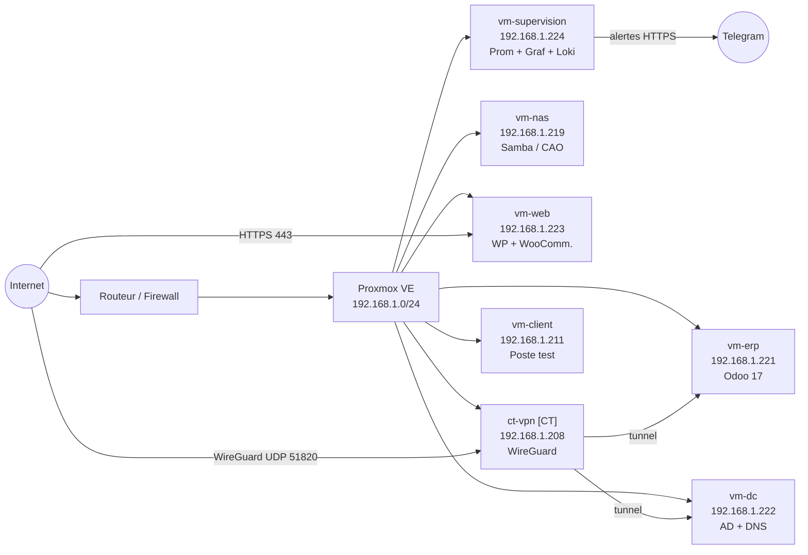

# Schéma — Réseau METALIS

## Plan d'adressage

| Réseau | Masque | Usage |
|---|---|---|
| 192.168.1.0/24 | /24 | Réseau lab — toutes les VMs et le CT Proxmox |

## Hôtes fixes

| Hôte | ID Proxmox | IP | Rôle |
|---|---|---|---|
| `ct-vpn` (CT) | 100 | 192.168.1.208 | WireGuard VPN |
| `vm-client` | 101 | 192.168.1.211 | Poste de test |
| `vm-dc` | 102 | 192.168.1.222 | Active Directory + DNS |
| `vm-supervision` | 103 | 192.168.1.224 | Prometheus + Grafana + Loki |
| `vm-erp` | 104 | 192.168.1.221 | Odoo 17 |
| `vm-nas` | 105 | 192.168.1.219 | Fichiers CAO (Samba) |
| `vm-clone` | 106 | — | Template de base |
| `vm-web` | 107 | 192.168.1.223 | WordPress + WooCommerce |

## Règles de flux

| Source | Destination | Port | Autorisation |
|---|---|---|---|
| vm-client | vm-nas | 445 (SMB) | ✅ Autorisé |
| vm-client | vm-erp | 8069 (Odoo) | ✅ Autorisé |
| vm-web | vm-erp | API Odoo | ✅ Autorisé (API uniquement) |
| Internet | vm-web | 80, 443 | ✅ Autorisé |
| Internet | ct-vpn | 51820 UDP (WireGuard) | ✅ Autorisé |
| ct-vpn | vm-erp | 8069 (Odoo) | ✅ Autorisé (commerciaux) |
| ct-vpn | Atelier VLAN 20 | Ports CNC | ✅ Autorisé (prestataire restreint) |
| Internet | vm-dc / vm-nas / vm-erp | Tout | ❌ Bloqué |
| vm-supervision | Toutes VMs | 9100 (node_exporter) | ✅ Autorisé |
| vm-supervision | Telegram (Internet) | 443 | ✅ Autorisé (alertes) |

## Diagramme réseau (Mermaid)



## Configuration Proxmox — Linux Bridge

```
# /etc/network/interfaces (nœud Proxmox)

auto lo
iface lo inet loopback

# Interface physique
auto enp3s0
iface enp3s0 inet manual

# Bridge principal
auto vmbr0
iface vmbr0 inet static
    address 192.168.1.3/24
    gateway 192.168.1.1
    bridge-ports enp3s0
    bridge-stp off
    bridge-fd 0
    bridge-vlan-aware yes
    bridge-vids 2-4094
```

Chaque VM se voit attribuer une IP fixe dans la configuration réseau Proxmox (onglet Hardware > Network Device).
