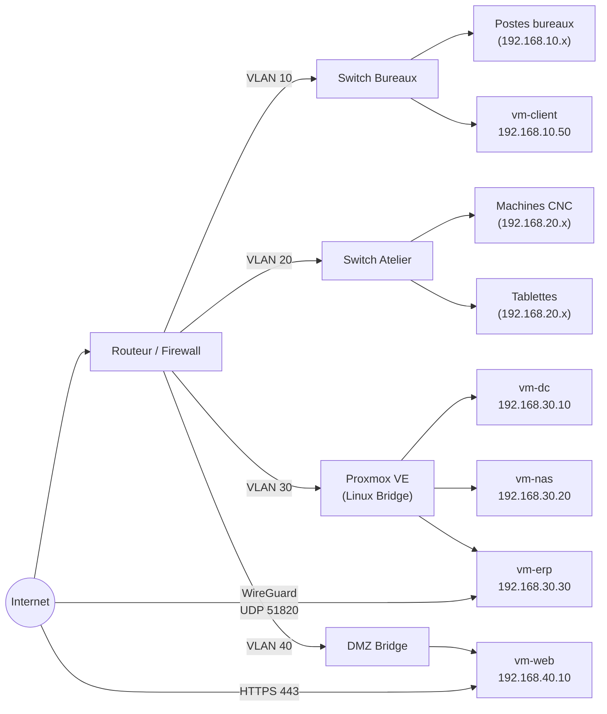

# Schéma — Réseau METALIS

## Plan d'adressage

| VLAN | Nom | Réseau | Passerelle | Usage |
|---|---|---|---|---|
| 10 | Bureaux | 192.168.10.0/24 | 192.168.10.1 | Postes administratifs, commerciaux |
| 20 | Atelier | 192.168.20.0/24 | 192.168.20.1 | CNC, douchettes, tablettes |
| 30 | Serveurs | 192.168.30.0/24 | 192.168.30.1 | VMs Proxmox (DC, NAS, ERP) |
| 40 | DMZ | 192.168.40.0/24 | 192.168.40.1 | vm-web (exposition publique) |
| 99 | Management | 192.168.99.0/24 | 192.168.99.1 | Interface Proxmox (accès restreint) |

## Hôtes fixes

| Hôte | IP | VLAN | Rôle |
|---|---|---|---|
| Proxmox (management) | 192.168.99.10 | 99 | Interface d'administration |
| vm-dc | 192.168.30.10 | 30 | Active Directory + DNS |
| vm-nas | 192.168.30.20 | 30 | Fichiers CAO |
| vm-erp | 192.168.30.30 | 30 | Odoo 17 |
| vm-web | 192.168.40.10 | 40 | WordPress + WooCommerce |
| vm-client | 192.168.10.50 | 10 | Poste de test |

## Règles de flux inter-VLAN

| Source | Destination | Port | Autorisation |
|---|---|---|---|
| VLAN 10 (Bureaux) | VLAN 30 (Serveurs) | 445 (SMB), 8069 (Odoo) | ✅ Autorisé |
| VLAN 20 (Atelier) | VLAN 30 (Serveurs) | 445 (SMB) | ✅ Autorisé (lecture seule) |
| VLAN 40 (DMZ) | VLAN 30 (Serveurs) | 5432 (API Odoo) | ✅ Autorisé (API uniquement) |
| VLAN 40 (DMZ) | VLAN 10/20/30 | Tout | ❌ Bloqué |
| Internet | VLAN 40 (DMZ) | 80, 443 | ✅ Autorisé |
| Internet | VLAN 30 | Tout sauf 51820 UDP | ❌ Bloqué |
| VPN WireGuard | VLAN 30 | 8069 (Odoo) | ✅ Autorisé |
| VPN Prestataire | VLAN 20 | Ports CNC | ✅ Autorisé (restreint) |

## Diagramme réseau (Mermaid)



## Configuration Proxmox — Linux Bridge

```
# /etc/network/interfaces (nœud Proxmox)

auto lo
iface lo inet loopback

# Interface physique (trunk VLAN)
auto enp3s0
iface enp3s0 inet manual

# Bridge principal (VLAN-aware)
auto vmbr0
iface vmbr0 inet static
    address 192.168.99.10/24
    gateway 192.168.99.1
    bridge-ports enp3s0
    bridge-stp off
    bridge-fd 0
    bridge-vlan-aware yes
    bridge-vids 2-4094
```

Chaque VM se voit attribuer un tag VLAN dans la configuration réseau Proxmox (onglet Hardware > Network Device > VLAN Tag).
